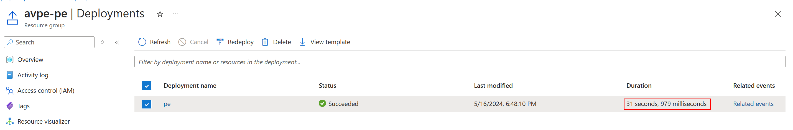
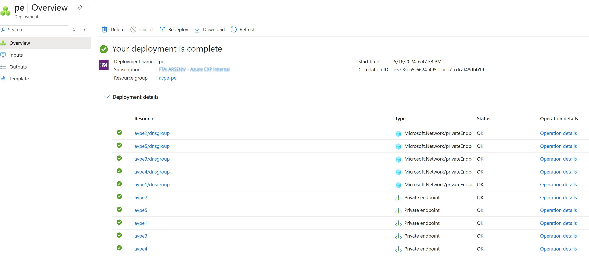
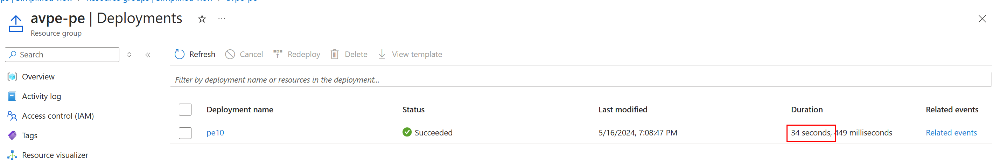
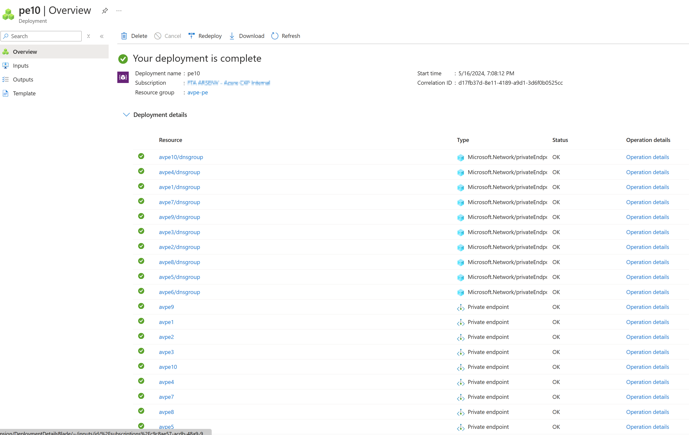
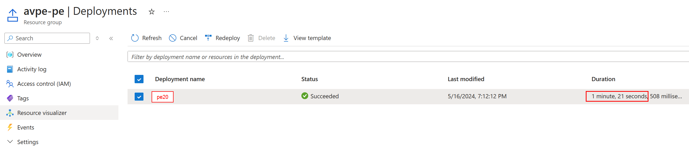
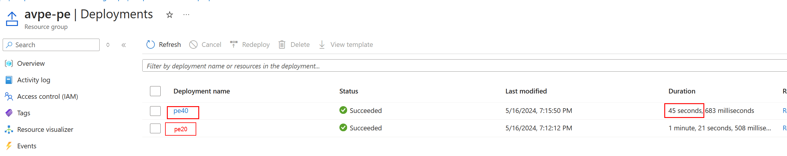
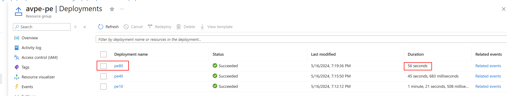
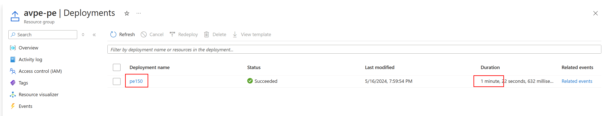
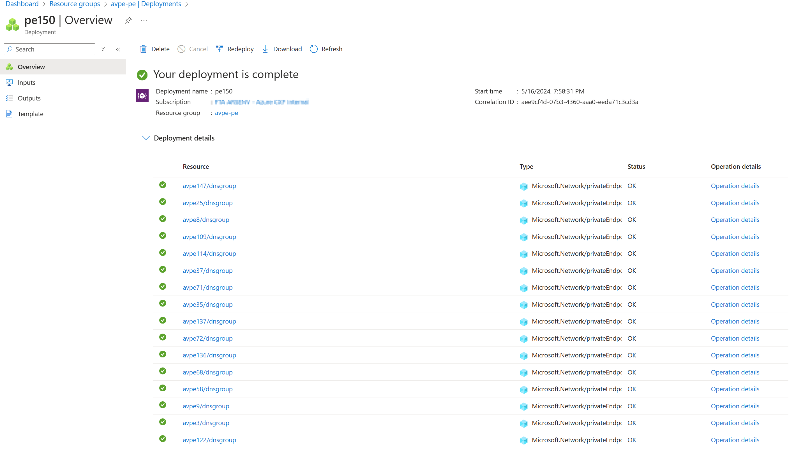
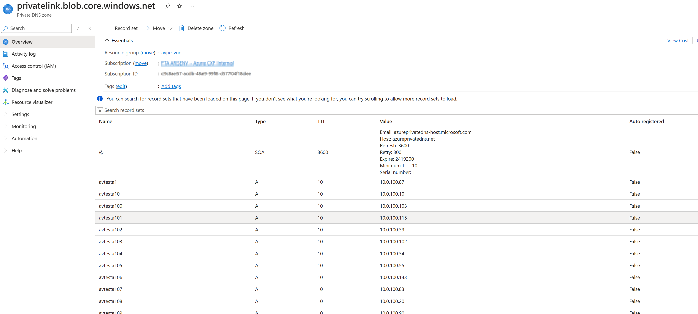

# Testing concurrent creation of multiple Private Endpoints in the same subnet

## Create storage accounts to later use as private endpoint targets

Bicep template creates storage accounts in batches of 10 to avoid hitting concurrency limits on storage accounts being created at the same time.

```bash
az group create --name avpe-storage --location eastus2
az deployment group create --resource-group avpe-storage --template-file storage.bicep --parameters storageAccountPrefix=avtesta storageAccountCount=150
```

## Create VNet

```bash
az group create --name avpe-vnet --location eastus2
az deployment group create --resource-group avpe-vnet --template-file vnet.bicep --parameters vnetName=avpe-vnet privateDnsZoneName=privatelink.blob.core.windows.net
```

## Create Private Endpoints

Varying number of private endpoints being created concurrently by changing the `peCount` parameter and the start index.

```bash
az group create --name avpe-pe --location eastus2

az deployment group create --resource-group avpe-pe --template-file pe.bicep --name pe150 --parameters peNamePrefix=avpe subnetId="/subscriptions/c9c8ae57-acdb-48a9-99f8-d57704f18dee/resourceGroups/avpe-vnet/providers/Microsoft.Network/virtualNetworks/avpe-vnet/subnets/subnet-pe" storageAccountResourceIdPrefix=/subscriptions/c9c8ae57-acdb-48a9-99f8-d57704f18dee/resourceGroups/avpe-storage/providers/Microsoft.Storage/storageAccounts/avtesta privateDnsZoneId=/subscriptions/c9c8ae57-acdb-48a9-99f8-d57704f18dee/resourceGroups/avpe-vnet/providers/Microsoft.Network/privateDnsZones/privatelink.blob.core.windows.net startIndex=1 peCount=150
```

## Screenshots











